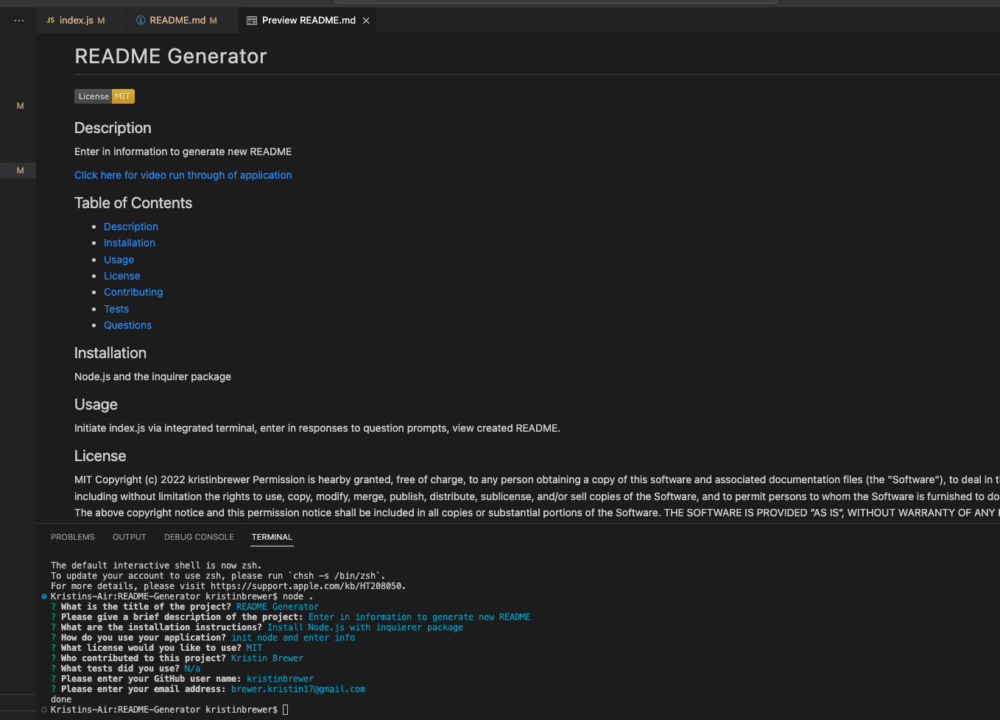

# README Generator

[](https://opensource.org/licenses/MIT)

## Description
This command-line application allows users to dynamically generate README documents given use of Node.js. When users use the command of ```node index.js``` the application will begin. Users will be prompted to input a title of their application, description, installation information, usage, contributor and tests used. They will be given the option of available licenses; when license is chosen, chosen license badge and information will generate to the README. They will also be prompted for their gitHub account and email to be displayed on the README Question section. When the user name is clicked on in the README, it will open a browser page to the profile. A Table of Contents will be available that will take user to cooresponding portions of page when clicked. 



[Video run through of application](https://drive.google.com/file/d/1fQxWhNPbs-HCghFDbvgFo8LCFOGqgfn2/view?usp=sharing)

[GitHub Repo](https://github.com/kristinbrewer/README-Generator)


## Table of Contents
- [Description](#description)
- [Installation](#installation)
- [Usage](#usage)
- [License](#license)
- [Contributing](#contributing)
- [Tests](#tests)
- [Questions](#questions)

## Installation
Node.js and the inquirer package

## Usage
Initiate index.js via integrated terminal, enter in responses to question prompts, view created README.

## License
MIT Copyright (c) 2022 kristinbrewer
Permission is hearby granted, free of charge, to any person obtaining a copy of this software and associated documentation files (the "Software"), to deal in the Software without restriction, including without limitation the rights to use, copy, modify, merge, publish, distribute, sublicense, and/or sell copies of the Software, and to permit persons to whom the Software is furnished to do so, subject to the following conditions: The above copyright notice and this permission notice shall be included in all copies or substantial portions of the Software. THE SOFTWARE IS PROVIDED ”AS IS”, WITHOUT WARRANTY OF ANY KIND, EXPRESS OR IMPLIED, INCLUDING BUT NOT LIMITED TO THE WARRANTIES OF MERCHANTABILITY, FITNESS FOR A PARTICULAR PURPOSE AND NONINFRINGEMENT. IN NO EVENT SHALL THE AUTHORS OR COPYRIGHT HOLDERS BE LIABLE FOR ANY CLAIM, DAMAGES OR OTHER LIABILITY, WHETHER IN AN ACTION OF CONTRACT, TORT OR OTHERWISE, ARISING FROM, OUT OF OR IN CONNECTION WITH THE SOFTWARE OR THE USE OR OTHER DEALINGS IN THE SOFTWARE. 

## Contributing
Kristin Brewer

## Tests
N/a

## Questions
For more information, my GitHub account is: [kristinbrewer](https://github.com/kristinbrewer).
Please email me at: brewer.kristin17@gmail.com with any additional questions. 